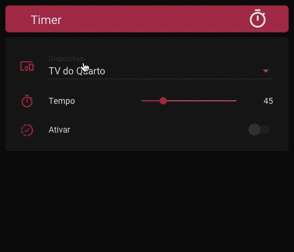

# Timer for Home Assistant with Node-RED



## Resources used:
* Button-card to display buttons with personalized names https://github.com/custom-cards/button-card
<br> Obs. The button-card feature can be installed through the HACS - Home Assistant Community Store

* Node-RED to create the timer schedule https://github.com/hassio-addons/addon-node-red
<br> Obs. Node-RED can be installed via the Add-on Store within the Supervisor


## Entities we will use:
* input_boolean
* input_number
* input_select
* sensor template
* time_date sensor

## Configuration


## 1st Step - Input Boolean:

We start with the input that will be used to activate the timer programming sequence;
```
input_boolean:

  #Input to activate the timer
  timer_activate:
    name: Timer
    initial: off
    icon: mdi: progress-check
```

Then we add the inputs for each device. <br>
These inputs will be used as buttons that signal when a timer is activated and to cancel a timer when clicking. <br>
Make an input_boolean for each device you want to add to the timer list.
```
  #Maintain this formatting for easy "timer_name_do_device" configuration
  #Keep a pattern in the name formatting, as it is this name that will be displayed when the timer is active.
  
  timer_tv_room:
    name: Timer - Room TV
    initial: off
    icon: mdi: television

  timer_lampadas:
    name: Timer - Lamps
    initial: off
    icon: mdi: lightbulb-group-outline
```
Result:
* input_boolean.timer_ativar
* input_boolean.timer_tv_quarto
* input_boolean.timer_lampadas


## 2nd Step - Input Number:
Let's create an input_number that will be used to define the timer minutes.
You can choose a slider input (as in the gif).
```
input_number:

  timer_minutes:
    icon: mdi: timer
    name: Timer
    initial: 5
    min: 5
    max: 180
    step: 5
```
Or you can choose a boxed input to enter the value:
```
input_number:

  timer_minutes:
    icon: mdi: timer
    name: Timer
    initial: 5
    min: 5
    max: 180
    step: 5
    mode: box
```
Result:
* input_number.timer_minutes


## 3rd Step - Input Select:

The input_select will be used to create the selection list with the devices on the timer interface.
Add the options according to your needs. <br>
ATTENTION! Only add options that have input_booleans created.
```
input_select:

  timer_lista:
    name: 'Timer - Devices'
    icon: mdi: devices
    options: # Only add options that have input_boolean
      - Bedroom TV
      - Lamps
```
Result:
* input_select.timer_lista

## 4th Step - Sensor template

We are going to create sensors with templates to calculate and display the time remaining for the device to be turned off.
ATTENTION! When creating more sensors for your devices, also change the calculation template. That is why it is important to maintain a "timer_name_do_device" pattern. Note that the "value_template" refers to the sensor itself and the input_boolean of the device in question. Compare the two examples below.
```
sensor:
  - platform: template
    sensors:

      timer_tv_room:
        friendly_name: 'Timer - Bedroom TV'
        unit_of_measurement: min
        value_template: "
        {{(((((state_attr ('sensor.timer_tv_quarto', 'timer') '| float ()) * 60) - (as_timestamp (now ()) - as_timestamp (states.input_boolean.timer_tv_quarto.last_changed)) / 60) | round (0)}}
         "
        attribute_templates:
          timer:> -
            {{state_attr ('sensor.timer_tv_quarto', 'timer')}}

      timer_lampadas:
        friendly_name: 'Timer - Lamps'
        unit_of_measurement: min
        value_template: "
        {{(((((state_attr ('sensor.timer_lampadas',' timer ')' float ()) * 60) - (as_timestamp (now ()) - as_timestamp (states.input_boolean.timer_lampadas.last_changed))) / 60) | round (0)}}
         "
        attribute_templates:
          timer:> -
            {{state_attr ('sensor.timer_lampadas', 'timer')}}
```
Result:
* sensor.timer_tv_quarto
* sensor.timer_lampadas


## 5th Stage - Time_date sensor

This is a sensor that generates the current time. It is used in programming the sensors above to force the countdown to update.
```
sensor:
  - platform: time_date
    display_options:
      - 'time'
```
Result:
* sensor.time


## 6th Step - Check the settings and restart the Home Assistant
## 7ª Stage - Node-RED
The Node-RED stream must be imported and then edited according to your needs. <br>
To import, you can download the .json file or copy the code and paste it into the Node-RED import window. <br>
[Click here to copy or download the code for Node-RED flows] (https://github.com/orickcorreia/timer-homeassistant/blob/master/nodered_timer.json)

## 8th Step - Applying to the interface (Lovelace)

```
- type: vertical-stack
  cards:

  # Title Header
  - type: 'custom: button-card'
    layout: icon_name
    name: Timer
    icon: mdi: timer
    styles:
      grid:
        - grid-template-areas: '"n i"'
        - grid-template-columns: 1fr 20%
      icon:
        - align-self: end
        - color: var (- text-primary-color)
        - height: 35px
      card:
        - padding: 5px
        - height: 45px
        - background: var (- primary-color)
      name:
        - color: var (- text-primary-color)
        - justify-self: start
        - padding-left: 10%
        - font-weight: 400
        - font-size: 20px

  # Timer panel
  - type: entities
    show_header_toggle: false
    entities:
      - entity: input_select.timer_lista
        name: Device
      - entity: input_number.timer_minutes
        name: Weather
      - entity: input_boolean.timer
        name: Enable
        
  #Conditional to display only when the timer is on the Lamps
  - type: conditional
    conditions:
      - entity: input_boolean.timer_lampadas
        state: "on"
    card:
      entity: input_boolean.timer_lampadas
      type: "custom: button-card"
      layout: icon_name
      tap_action:
        action: toggle
      label:>
        [[[
          return 'Shutting down at' + (states ['sensor.timer_lampadas']. state) + 'min'; ;
        ]]]
      show_label: true
      styles:
        grid:
          - grid-template-areas: '"i n l"'
          - grid-template-columns: 15% 35% 50%
        icon:
          - align-self: start
          - color: var (- primary-color)
          - height: 40px
        card:
          - padding: 5px
          - height: 45px
        name:
          - justify-self: start
          - font-weight: 400
          - font-size: 14px
        label:
          - justify-self: end
          - font-weight: 400
          - font-size: 14px
          - padding-right: 10%

  #Conditional to display only when the timer is active on the Bedroom TVs
  - type: conditional
    conditions:
      - entity: input_boolean.timer_tv_quarto
        state: "on"
    card:
      entity: input_boolean.timer_tv_quarto
      type: "custom: button-card"
      layout: icon_name
      tap_action:
        action: toggle
      label:>
        [[[
          return 'Shutting down at' + (states ['sensor.timer_tv_quarto']. state) + 'min'; ;
        ]]]
      show_label: true
      styles:
        grid:
          - grid-template-areas: '"i n l"'
          - grid-template-columns: 15% 35% 50%
        icon:
          - align-self: start
          - color: var (- primary-color)
          - height: 40px
        card:
          - padding: 5px
          - height: 45px
        name:
          - justify-self: start
          - font-weight: 400
          - font-size: 14px
        label:
          - justify-self: end
          - font-weight: 400
          - font-size: 14px
          - padding-right: 10%
```

## How does the flow work?

In Node-RED you will find a programming flow for each device. These strings are identical. What changes is only the entities involved. Nodes have comments that explain the function and what should be changed. Import to your Node-RED and read the comments.


* <b> 1º Start Timer -> </b> Detects when the timer is activated, checking if intut_boolean.timer_ativar is in "on" status and triggers the flow for all sequences;

* <b> 2º Lampadas -> </b> Each sequence starts with a node that checks if the Name selected in the input_select.timer_lista is the same as the flow in question. If it is "Lampadas", for example, then Node-RED will follow the flow programmed with the entities related to the lamps: sensor.timer_lampadas and input_boolean.timer_lampadas;

* <b> 3rd Set Delay -> </b> Extracts the value of the input_number.timer_minutos and converts it to milliseconds to be used to define the delay time later on;

* <b> 4º get var Timer -> </b> Extracts the value of the input_number.timer_minutos again, but now to be used in the sensor to count down;

* <b> 5th Set Sensor -> </b> The value in minutes is inserted in the sensor.timer_lampadas to be used in the countdown;

* <b> 6th Delay 500ms -> </b> Delay to allow time for the Home Assistant to insert the minutes in the sensor and for the user's experience of realizing that the timer is being activated;

* <b> 7th turn_on Boolean -> </b> The input_boolean.timer_lampadas is activated so that it is displayed on the lovelace interface and can be deactivated, if necessary;

* <b> 8th Reset Activate Button -> </b> The input_boolean.timer_ativar returns to its original "off" state, to be ready for the next activation;

* <b> 9º variable -> </b> This is the delay that will receive the time that was collected by the node "Set Delay";

* <b> 10th Check -> </b> When the delay count is finished, the "Check" node checks whether the input_boolean.timer_lampadas is still active. This is where the fl

* <b> 11th turn_off Device -> </b> If the timer is still active, then this node will shutdown the device. For example: group.lampadas. This timer can be used for any call service at the end of the schedule. It can be used to program the timer to start, for example;

* <b> 12th turn_off Boolean -> </b> After completing the timer, input_boolean.timer_lampadas has its status updated to "off", thus disappearing from the lovelace interface.

## How do the sensors work?

The sensors are used to receive the programmed time in minutes and calculate the countdown to shutdown.

* <b> 1º -> </b> The "timer" attribute receives the time collected by the input_number.timer_minutos;
* <b> 2nd -> </b> The template checks whether sensor.time is different from 0. This forces the template to update the value every time sensor.time changes the minute (the timer sensor is just a clock );
* <b> 3rd -> </b> Then the value of the "timer" attribute is multiplied by 60 to be converted into seconds;
* <b> 4th -> </b> Collect the value of the "last_changed" attribute of the input_boolean to check when the input was activated and divide it by 60 to also convert in seconds;
* <b> 5º -> </b> Subtracts the time that the input_boolean was activated from the time assigned by the timer and with that we have a countdown;

That's why a sensor and an input_boolean are required for each device you want to add to the timer.


## Issue?
[ricardo@caulecriativo.com] (mailto: ricardo@caulecriativo.com)


